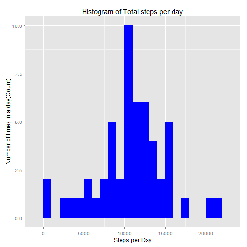
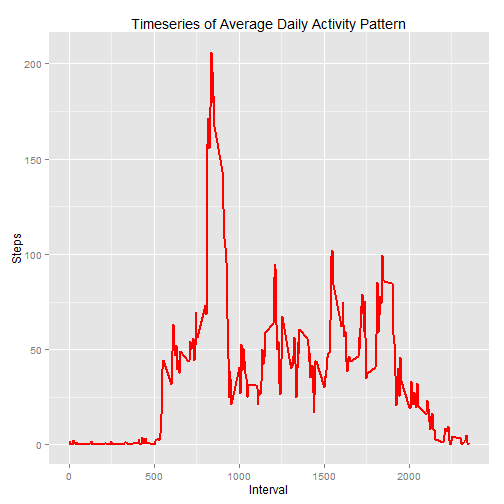
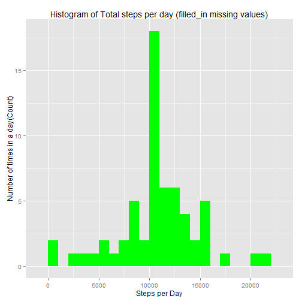
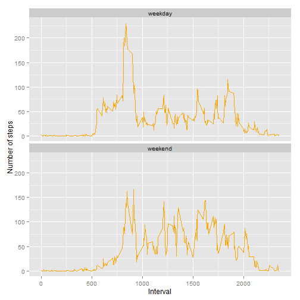

# Reproducible Research: Peer Assessment 1


## Loading and preprocessing the data

### Load the data

Assuming that the data is downloaded in the current working directory the following rcode will load the data into R/Rstudio.


```r
Activity <- read.csv("activity.csv")
head(Activity) 
```

```
##   steps       date interval
## 1    NA 2012-10-01        0
## 2    NA 2012-10-01        5
## 3    NA 2012-10-01       10
## 4    NA 2012-10-01       15
## 5    NA 2012-10-01       20
## 6    NA 2012-10-01       25
```

```r
str(Activity)
```

```
## 'data.frame':	17568 obs. of  3 variables:
##  $ steps   : int  NA NA NA NA NA NA NA NA NA NA ...
##  $ date    : Factor w/ 61 levels "2012-10-01","2012-10-02",..: 1 1 1 1 1 1 1 1 1 1 ...
##  $ interval: int  0 5 10 15 20 25 30 35 40 45 ...
```

### Preprocess the data


```r
Activity$date <- as.Date(Activity$date, format = "%Y-%m-%d")
Activity$interval <- as.factor(Activity$interval)
str(Activity)
```

```
## 'data.frame':	17568 obs. of  3 variables:
##  $ steps   : int  NA NA NA NA NA NA NA NA NA NA ...
##  $ date    : Date, format: "2012-10-01" "2012-10-01" ...
##  $ interval: Factor w/ 288 levels "0","5","10","15",..: 1 2 3 4 5 6 7 8 9 10 ...
```

## What is mean total number of steps taken per day?

First we need to calculate the total number of steps taken per day. Here we can ignore the missing values.

### Calculate the total number of steps per day


```r
totalsteps <- aggregate(steps ~ date, Activity, sum)
colnames(totalsteps) <- c("date","steps")
head(totalsteps)
```

```
##         date steps
## 1 2012-10-02   126
## 2 2012-10-03 11352
## 3 2012-10-04 12116
## 4 2012-10-05 13294
## 5 2012-10-06 15420
## 6 2012-10-07 11015
```


### Histogram of total number of steps per day


```r
library(ggplot2)
ggplot(totalsteps, aes(x = steps)) + 
       geom_histogram(fill = "blue", binwidth = 1000) + 
        labs(title="Histogram of Total steps per day", 
             x = "Steps per Day", y = "Number of times in a day(Count)") 
```

 

### Mean and median of the total number of steps taken per day


```r
mean_steps <- mean(totalsteps$steps, na.rm=TRUE)
format_mean_steps <- prettyNum(mean_steps)
median_steps <- median(totalsteps$steps, na.rm=TRUE)
```

The mean is 10766.19 and median is 10765.

## What is the average daily activity pattern?
First we calculate the aggregate steps by intervals of 5-minutes and then convert the intervals as integers, which will help in plotting.

### Aggregate steps by intervals of 5-minutes


```r
intervalsteps <- aggregate(Activity$steps, 
                           by = list(interval = Activity$interval),
                           FUN=mean, na.rm=TRUE)

intervalsteps$interval <- as.integer(levels(intervalsteps$interval)[intervalsteps$interval])
colnames(intervalsteps) <- c("interval", "steps")
head(intervalsteps)
```

```
##   interval     steps
## 1        0 1.7169811
## 2        5 0.3396226
## 3       10 0.1320755
## 4       15 0.1509434
## 5       20 0.0754717
## 6       25 2.0943396
```

### Timeseries Plot


```r
ggplot(intervalsteps, aes(x=interval, y=steps)) +   
        geom_line(color="red", size=1) +  
        labs(title="Timeseries of Average Daily Activity Pattern", x="Interval", y="Steps")  
```

 

### 5-minute interval that contains the maximum number of steps


```r
max_interval <- intervalsteps[which.max(intervalsteps$steps),]
head(max_interval)
```

```
##     interval    steps
## 104      835 206.1698
```

The ``835``th 5-minute interval contains the maximum number ``206.1698113`` steps.

## Imputing missing values

### Calculating total number of missing values in the dataset


```r
Activity_NA <- sum(is.na(Activity))
```

Total number of missing values in the dataset is 2304.

### The mean value at the same interval across days has been used to replace missing values in the dataset.


```r
fill_NA <- function(data, pervalue) {
        na_index <- which(is.na(data$steps))
        na_replace <- unlist(lapply(na_index, FUN=function(idx){
                interval = data[idx,]$interval
                pervalue[pervalue$interval == interval,]$steps
        }))
        fill_steps <- data$steps
        fill_steps[na_index] <- na_replace
        fill_steps
}
```

### New dataset equal to the original dataset with the missing values filled in


```r
Activity_fill <- data.frame(  
        steps = fill_NA(Activity, intervalsteps),  
        date = Activity$date,  
        interval = Activity$interval)
str(Activity_fill)
```

```
## 'data.frame':	17568 obs. of  3 variables:
##  $ steps   : num  1.717 0.3396 0.1321 0.1509 0.0755 ...
##  $ date    : Date, format: "2012-10-01" "2012-10-01" ...
##  $ interval: Factor w/ 288 levels "0","5","10","15",..: 1 2 3 4 5 6 7 8 9 10 ...
```

```r
head(Activity_fill)
```

```
##       steps       date interval
## 1 1.7169811 2012-10-01        0
## 2 0.3396226 2012-10-01        5
## 3 0.1320755 2012-10-01       10
## 4 0.1509434 2012-10-01       15
## 5 0.0754717 2012-10-01       20
## 6 2.0943396 2012-10-01       25
```

### Histogram of the total number of steps taken each day


```r
fill_totalsteps <- aggregate(steps ~ date, Activity_fill, sum)
colnames(fill_totalsteps) <- c("date","steps")
ggplot(fill_totalsteps, aes(x = steps)) + 
       geom_histogram(fill = "green", binwidth = 1000) + 
        labs(title="Histogram of Total steps per day (filled_in missing values)", 
             x = "Steps per Day", y = "Number of times in a day(Count)") 
```

 

###  Mean and median total number of steps taken per day


```r
mean_fill_steps <- mean(fill_totalsteps$steps, na.rm=TRUE)
format_mean_fill_steps <- prettyNum(mean_fill_steps)
median_fill_steps <- median(fill_totalsteps$steps, na.rm=TRUE)
format_median_fill_steps <- prettyNum(median_fill_steps)
```

The mean is 10766.19 and median is 10766.19

### Do these values differ from the estimates from the first part of the assignment? 

Yes,the median value differs from the estimates from the first part of the assignment.
 
#### Before filling the data  

        Mean    10766.19          
        Median  10765          

#### After filling the data

        Mean    10766.19
        Median  10766.19

### What is the impact of imputing missing data on the estimates of the total daily number of steps?

The impact of imputing missing data on the estimates is small. After replacing the missing values with the mean value at the same interval across days the median value has increased by 1.19. Also it is now equal to mean value of the number of steps taken per day.

## Are there differences in activity patterns between weekdays and weekends?

For this part of the assignment datasets with missing values filled-in has been used.

### A column has been added to the dataset to indicate the day of the week

```r
weekdays_steps <- function(data) {
    weekdays_steps <- aggregate(data$steps, by=list(interval = data$interval),
                          FUN=mean, na.rm=T)
    # convert to integers for plotting
    weekdays_steps$interval <- 
            as.integer(levels(weekdays_steps$interval)[weekdays_steps$interval])
    colnames(weekdays_steps) <- c("interval", "steps")
    weekdays_steps
}
```

### Subset the dataset into weekends and weekdays


```r
data_by_weekdays <- function(data) {
    data$weekday <- 
            as.factor(weekdays(data$date)) # weekdays
    weekend_data <- subset(data, weekday %in% c("Saturday","Sunday"))
    weekday_data <- subset(data, !weekday %in% c("Saturday","Sunday"))

    weekend_steps <- weekdays_steps(weekend_data)
    weekday_steps <- weekdays_steps(weekday_data)

    weekend_steps$dayofweek <- rep("weekend", nrow(weekend_steps))
    weekday_steps$dayofweek <- rep("weekday", nrow(weekday_steps))

    data_by_weekdays <- rbind(weekend_steps, weekday_steps)
    data_by_weekdays$dayofweek <- as.factor(data_by_weekdays$dayofweek)
    data_by_weekdays
}

data_weekdays <- data_by_weekdays(Activity_fill)
head(data_weekdays)
```

```
##   interval       steps dayofweek
## 1        0 0.214622642   weekend
## 2        5 0.042452830   weekend
## 3       10 0.016509434   weekend
## 4       15 0.018867925   weekend
## 5       20 0.009433962   weekend
## 6       25 3.511792453   weekend
```

### Panelplot containing timeseries plot for weekdays and weekends


```r
ggplot(data_weekdays, aes(x=interval, y=steps)) + 
        geom_line(color="orange") + 
        facet_wrap(~ dayofweek, nrow=2, ncol=1) +
        labs(Title= "Panelplot for weekdays and weekends", x="Interval", y="Number of steps")
```

 


